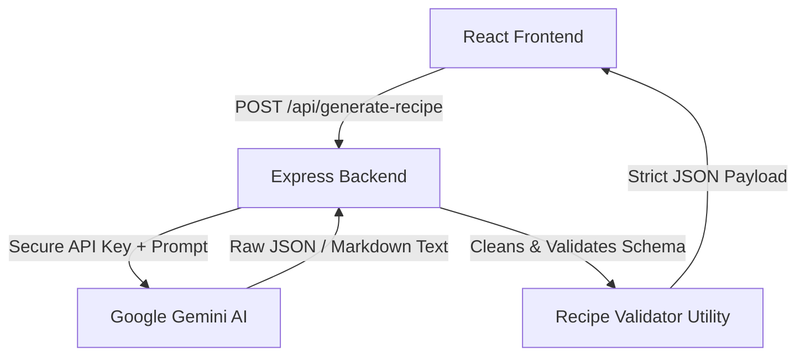

# AI Fridge to Recipe 🍳✨

An ultra-premium, futuristic AI-powered cooking assistant dashboard that takes ingredients from your fridge and turns them into gourmet recipes in real-time. Built with a Glassmorphism/soft neumorphism mobile-first aesthetic inspired by modern AR/VR spatial design systems (like Apple VisionOS).

---

## 🌟 Features

- **Futuristic Glassmorphic UI**: Translucent panels, smooth animated backdrops, floating orbs, hover elevation, and interactive states.
- **Strict JSON Generation & Validation**: Custom parser that guarantees the Google Gemini response exactly matches the expected schema.
- **Staged Loading Experience**: Immersive skeletons that guide you through stages (Reading Ingredients... Thinking Like a Chef... etc.) instead of a generic loading spinner.
- **Timelines & Checklists**: Interactive step-by-step cooking timelines and ingredient checklists with animated completion states.
- **Nutrition progress rings**: Circular SVG indicators illustrating Calories, Carbs, Protein, and Fat proportions.
- **Smart Swaps**: Substitutions suggestions for ingredients you might be missing.
- **Quick Action Bar**: One-click Copy, Print/PDF, Download JSON schema, Regenerating, and toggling favorites.
- **Session History & Favorites**: Easily switch back and forth between generated recipes in the active session.
- **Dark Mode Support**: Deep navy backgrounds, blue glass glows, and high-contrast typography.
- **Duplicate Request Cancellation**: Uses `AbortController` to cancel previous pending requests if the user clicks generate multiple times.

---

## ⚙️ Architecture



### Why a Backend Server is Required
1. **API Key Security**: Storing the `GEMINI_API_KEY` on the frontend would expose it to the browser. Running a backend ensures keys are kept secure in the server environment.
2. **Strict Response Validation**: Ensures the raw AI response is validated and cleaned before it is sent to the client, preventing unexpected schemas from breaking the React frontend.
3. **CORS and Control**: Allows setting up strict origin limits and request rate control.

---

## 📁 Folder Structure

```text
teju_flam/
├── client/                     # Vite + React Frontend
│   ├── src/
│   │   ├── components/        # UI Components (Header, Input, Cards, Skeletons)
│   │   ├── App.jsx            # Main view orchestration & Global State
│   │   ├── index.css          # Tailwind directives & Glassmorphism styles
│   │   └── main.jsx           # React app mount
│   ├── tailwind.config.js     # Glassmorphic utilities configurations
│   ├── vite.config.js         # Port mapping & proxy config
│   └── package.json           
│
├── server/                     # Node.js + Express Backend
│   ├── config/                # Gemini client configs
│   ├── controllers/           # Recipe processing endpoints
│   ├── routes/                # API router mapping
│   ├── services/              # AI Prompt construction & Call execution
│   ├── utils/                 # JSON parsing & validation mechanics
│   ├── index.js               # Express entrypoint
│   └── package.json
│
└── README.md                  # System Documentation
```

---

## 🛠️ Installation & Setup

### Prerequisites
- Node.js (v18+ recommended)
- A Google Gemini API Key (obtained from [Google AI Studio](https://aistudio.google.com/))

### 1. Backend Setup
1. Open a terminal and navigate to the `server` directory:
   ```bash
   cd server
   ```
2. Create a `.env` file from the template:
   ```bash
   cp .env.example .env
   ```
3. Open `.env` and fill in your Gemini API Key:
   ```text
   PORT=5000
   GEMINI_API_KEY=your_actual_gemini_api_key_here
   ```
4. Install dependencies and start the dev server:
   ```bash
   npm install
   npm run dev
   ```
   The backend will start on `http://localhost:5000`.

### 2. Frontend Setup
1. Open a new terminal and navigate to the `client` directory:
   ```bash
   cd client
   ```
2. Install dependencies:
   ```bash
   npm install
   ```
3. Start the Vite development server:
   ```bash
   npm run dev
   ```
   The app will be available on `http://localhost:3000`.

---

## 🤖 How AI Works & Prompt Engineering

The system uses `gemini-1.5-flash` due to its high speed, low latency, and native support for structured JSON output (`responseMimeType: "application/json"`).

### System Prompt Engineering
The system sends a carefully structured prompt enclosing constraints to force Gemini to act as a chef:

```text
You are a professional chef.
Return ONLY valid JSON. No markdown. No explanation.
Return EXACTLY in this JSON format:
{
 "recipeName": "...",
 "description": "...",
 "cookTime": "...",
 "difficulty": "...",
 "servings": 2,
 "ingredients": [{ "name": "...", "quantity": "..." }],
 "steps": ["..."],
 "swaps": ["..."],
 "nutrition": { "calories": "...", "protein": "...", "fat": "...", "carbs": "..." }
}
Given ingredients list: [User Input]
```

### Validation Strategy
To guarantee frontend robustness, the backend passes all raw AI outputs through `server/utils/recipeValidator.js` which:
1. Strips any enclosing markdown block characters (e.g. ` ```json ` ... ` ``` `) if present.
2. Runs `JSON.parse` inside a try-catch block.
3. Automatically maps and validates property names, formatting styles, and data types.
4. Fills in safe placeholder values for missing properties.
5. Rejects and throws an error if crucial arrays (like `ingredients` or `steps`) are missing or empty.
6. Eliminates duplicate ingredients and cooking steps.
7. Enforces response length constraints.

---

## ⚠️ Known Limitations & Future Improvements

- **Session History Persistence**: History is stored in React memory and clears on refresh. Future steps would link this to `localStorage` or a database.
- **Ingredient Autocomplete**: Users currently type raw ingredient text. Integrating a local dataset/API to autoselect ingredients would improve user experience.
- **Dynamic Portioning**: Add a servings multiplier that automatically calculates scaled ingredient quantities.

---

## ⏱️ Details

- **Time Spent**: ~3 Hours
- **AI Tools Used**: Gemini 3.5 Flash
